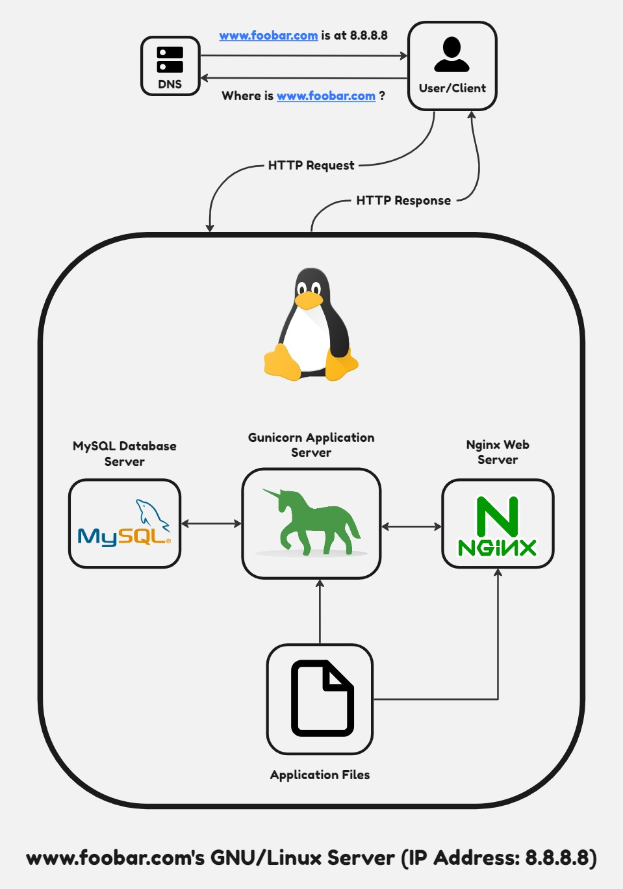

# A Simple Web Stack

## Description

This file contains a basic web infrastructure designed to host a website accessible via `www.foobar.com`. The setup lacks firewalls or SSL certificates to safeguard the server's network. Resources such as CPU, RAM, and SSD are shared among the server's components, including the database and application server.

## The Specifics About This Infrastructure

+ Definition of a server: A server refers to either computer hardware or software that delivers services to other computers, typically referred to as *clients*.

+ Purpose of a domain name: It acts as a user-friendly alias for an IP Address. For instance, `www.wikipedia.org` is easier to recognize than `91.198.174.192`. The Domain Name System (DNS) maps the IP address to its domain name alias.

+ DNS record type for `www` in `www.foobar.com`: `www.foobar.com` utilizes an **A record**, verifiable via `dig www.foobar.com`. Note: the results might differ, but this infrastructure employs an **A** record. <i>An Address Mapping record (A Record) stores a hostname and its corresponding IPv4 address.</i>

+ Role of the web server: The web server, whether software or hardware, processes requests through HTTP or secure HTTP (HTTPS) and furnishes the requested resource or an error message.

+ Function of the application server: It's responsible for installing, operating, and hosting applications and their services, catering to end users, IT services, and organizations. It facilitates the hosting and delivery of sophisticated consumer or business applications.

+ Purpose of the database: To manage an organized collection of information, easily accessible, managed, and updated.

+ Communication between server and client (user's computer requesting the website): The exchange occurs over the internet network using the TCP/IP protocol suite.

## The Issues With This Infrastructure

+ Multiple Single Points of Failure (SPOFs) exist within this infrastructure. For instance, if the MySQL database server encounters issues, the entire site would be inaccessible.

+ Downtime during maintenance: When maintenance checks are necessary for any component, they must either be taken offline or the server turned off. Since there's only one server, this results in website downtime.

+ Inability to handle increased traffic: Scaling this infrastructure proves difficult because all required components reside on a single server. When inundated with requests, the server can quickly exhaust resources or slow down significantly.