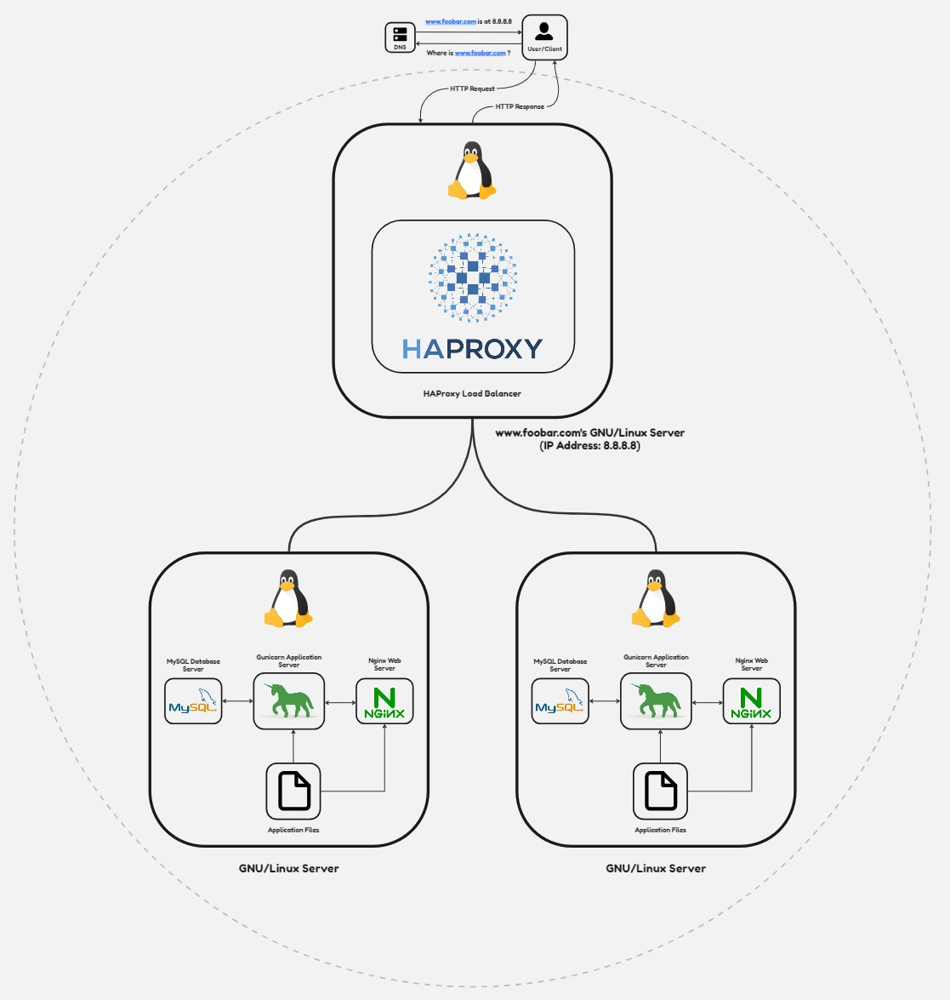

# The Distributed Web Infrastructure

## Description

This infrastructure operates as a distributed web system aiming to decrease primary server traffic by distributing part of the load to a replica server, facilitated by a load balancer responsible for load balancing between the primary and replica servers.

## Specifics About This Infrastructure

+ Load balancer's distribution algorithm and functionality:
  - The HAProxy load balancer is configured with the Round Robin distribution algorithm. This algorithm operates by cyclically using each server behind the load balancer based on their assigned weights. It maintains a fair distribution of processing time across servers. As a dynamic algorithm, Round Robin allows for real-time adjustments in server weights.
  
+ Load balancer-enabled setup:
  - The HAProxy load balancer enables an Active-Passive setup rather than an Active-Active setup. In an Active-Active setup, workloads are distributed across all nodes to prevent overloading. This enhances throughput and response times due to multiple nodes being available. Conversely, an Active-Passive setup involves not all nodes being active simultaneously. For instance, in a two-node setup, if one node is active, the other remains passive or on standby. The next passive node can become active if the preceding one becomes inactive.

+ Functionality of a database Primary-Replica (Master-Slave) cluster:
  - A Primary-Replica setup designates one server as the Primary server and another as a Replica. The Primary server handles read/write requests while the Replica server solely manages read requests. Data synchronization between these servers occurs whenever the Primary server executes a write operation.

+ Contrast between the Primary and Replica nodes in the application context:
  - The Primary node manages all write operations necessary for the site, whereas the Replica node handles read operations, reducing read traffic to the Primary node.

## Challenges With This Infrastructure

+ Presence of multiple Single Points of Failure (SPOFs):
  - For instance, if the Primary MySQL database server encounters issues, the entire site will be unable to perform site modifications (e.g., adding or removing users). Additionally, servers hosting the load balancer and the application server linked to the primary database server are also SPOFs.

+ Security concerns:
  - Data transmitted over the network lacks encryption using an SSL certificate, potentially exposing it to eavesdropping by hackers. Absence of a firewall on any server means unauthorized IPs cannot be blocked.

+ Lack of monitoring:
  - Absence of server monitoring tools makes it impossible to ascertain the status of each server in the infrastructure.