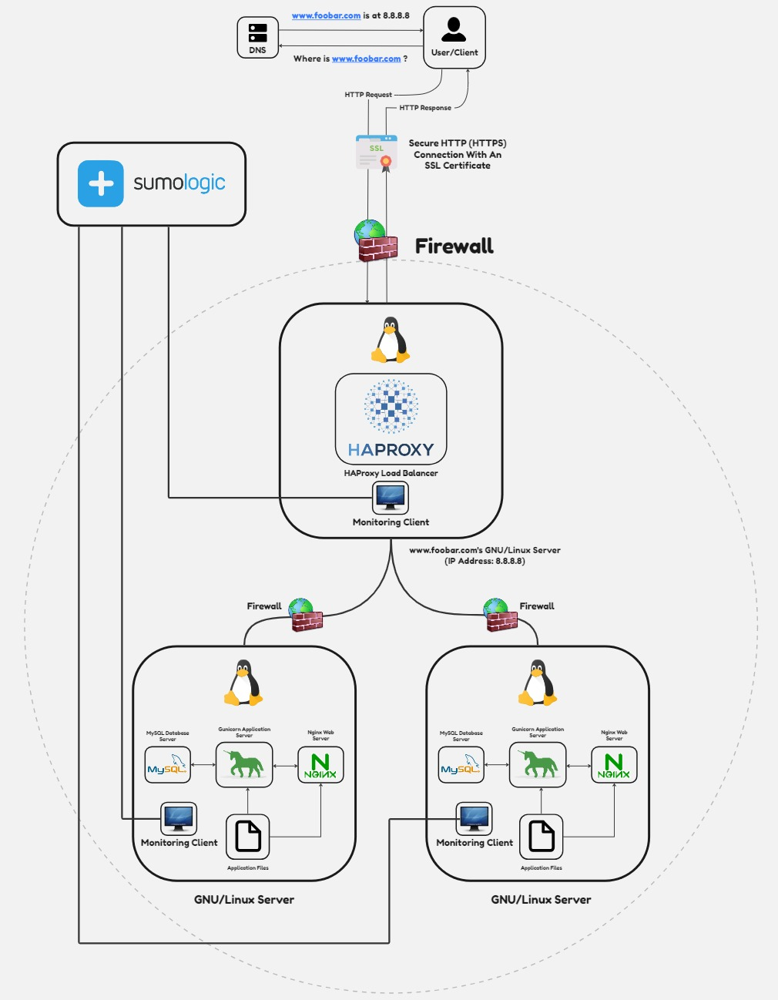

# Secured and Monitored Web Infrastructure

## Description

This web infrastructure comprises three servers and is meticulously secured, actively monitored, and exclusively serves encrypted traffic.

## Specifics About This Infrastructure

+ Role of the firewalls:
  - The firewalls act as protective barriers, specifically safeguarding the web servers from unauthorized and unwanted access. Positioned as intermediaries between the internal and external networks, they block incoming traffic matching the defined criteria.

+ Role of the SSL certificate:
  - SSL certificates serve the purpose of encrypting traffic transmitted between the web servers and the external network. Their primary function is to prevent man-in-the-middle attacks (MITM) and thwart network sniffers from intercepting traffic, thereby safeguarding valuable information. SSL certificates ensure privacy, integrity, and identification.

+ Role of the monitoring clients:
  - The monitoring clients are responsible for continuously observing the servers and the external network. They analyze server performance and operations, evaluating overall health and promptly alerting administrators of any deviations from expected performance. These monitoring tools provide crucial metrics about server operations, automatically testing server accessibility, measuring response times, and detecting errors, including corrupt or missing files, security vulnerabilities, and various other issues.

## Challenges With This Infrastructure

+ SSL termination at the load balancer level:
  - Terminating SSL at the load balancer could potentially leave traffic between the load balancer and web servers unencrypted, creating a security vulnerability.

+ Single MySQL server as a bottleneck:
  - Relying on a single MySQL server poses scalability issues and represents a potential single point of failure for the entire web infrastructure.

+ Homogeneous server components leading to resource contention:
  - Deploying servers with identical components results in resource contention, such as CPU, Memory, and I/O, potentially leading to poor performance. Identifying and resolving performance issues becomes challenging in such a setup, rendering it less scalable.